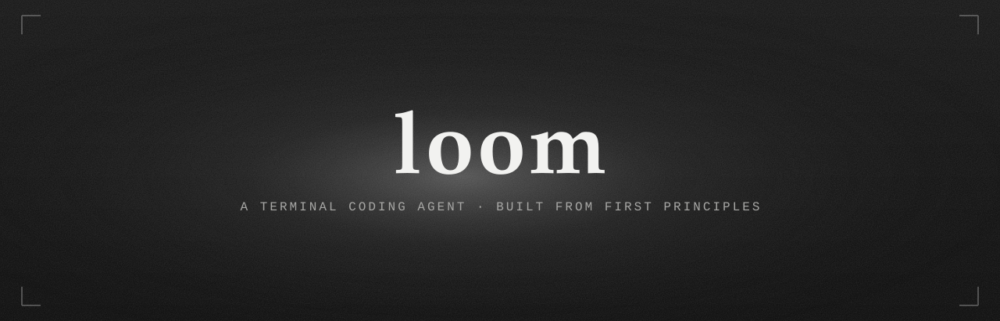

## **What is Loom?**

Loom is a terminal coding agent, built from the ground up in plain Python — no
LangChain, no CrewAI, no AutoGen, no agent framework of any kind. It exists to
answer one question by actually building the answer: **what is a coding agent
made of, underneath the framework?**

Every real agent worth learning from is the same three ideas wearing
different clothes:

1. **Messages are the state.** The transcript is an ordered, append-only list. Nothing lives outside it that matters for replay.
2. **The loop is provider-agnostic and UI-agnostic.** It only knows about messages, tools, and events — never a renderer, never a vendor SDK.
3. **Progress is an event stream, not a return value.** The loop emits typed events so any number of frontends can render the same run differently.

Loom builds those three ideas first, by hand, then layers on everything else
— tools, sessions, skills, a TUI — one deliberate phase at a time. This is
**not** a race to feature parity with a 500K-line production agent. It's a
minimal, readable version built to teach you why each piece exists.

See [`REFERENCES.md`](REFERENCES.md) for which real agents this project
studies, and which specific design decisions came from where.


## **Quick Start**

**Requirements:** Python 3.12+, [uv](https://docs.astral.sh/uv/)

```bash
# clone the repo
git clone https://github.com/Akshayredekar07/loom.git
cd loom

# install the workspace
uv sync --dev

# once the CLI stub exists (Phase 0)
uv run loom --version
```

Loom isn't installable from PyPI yet — it's built phase by phase, in order,
by you.


## **Architecture**

Three packages, one direction of dependency — enforced, not just documented:

```text
loom_app  →  loom_core  →  loom_provider
(CLI/TUI)    (portable      (vendor-specific
              agent brain)   streaming, normalized)
```

```text
┌─────────────┐     ┌──────────────┐     ┌────────────────┐
│  loom_app   │ ──▶│  loom_core   │ ──▶ │  loom_provider │
│  CLI, TUI,  │     │  messages,   │     │  OpenAI/       │
│  sessions,  │     │  tools,      │     │  Anthropic     │
│  skills     │     │  events,     │     │  adapters,     │
│             │     │  agent loop  │     │  StreamEvent   │
└─────────────┘     └──────────────┘     └────────────────┘
```

## **Repository Layout**

| Path | Contents |
|---|---|
| `packages/loom_provider/` | Vendor-specific streaming (OpenAI/Anthropic), normalized to one internal `StreamEvent` type |
| `packages/loom_core/` | The portable brain — messages, tools, events, the agent loop, the harness. No I/O, no UI. |
| `packages/loom_app/` | The actual application — CLI, TUI, built-in tools, sessions, skills |
| `dev-notes/` | Phase-by-phase design docs, written before the matching code |
| `dev-notes/adr/` | Architecture Decision Records — one short file per non-obvious design choice |
| `tests/` | Mirrors the package layout, one test dir per package |


## **How to Use This Repo**

This is not a "clone and run" project — it's a "clone and *build*" project.

1. Read a phase's `dev-notes/` doc in full, including the "why" sections.
2. Implement it yourself. Type it; don't paste it.
3. Run that phase's checklist. All boxes green before moving on.
4. Write a short entry in `dev-notes/` — what you built, what you decided
   against, and why. That's what makes the repo legible to future-you.


## **Contributing**

This is a personal learning project — it isn't accepting external
contributions right now. Fork it and build your own version; that's the
point.

## **License**

[MIT](LICENSE). Pick one before your first commit and add the matching `LICENSE`
file; the badge above assumes MIT.