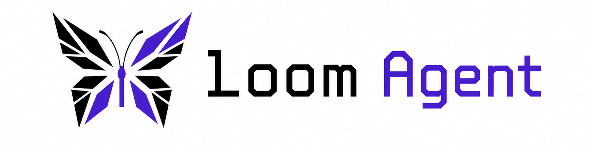

<p align="center">
  
  
  
  
</p>

<p align="center">
  A terminal coding agent built from scratch
</p>

---

## What Is Loom

Loom exists to answer one question by actually building the answer: what is a coding agent made of, underneath the framework?

Every real agent worth learning from is the same three ideas wearing different clothes.

| # | Idea | What it means in Loom |
|---|---|---|
| 1 | Messages are the state | The transcript is an ordered, append only list. Nothing lives outside it that matters for replay. |
| 2 | The loop is provider agnostic and UI agnostic | It only knows about messages, tools, and events, never a renderer, never a vendor SDK. |
| 3 | Progress is an event stream, not a return value | The loop emits typed events so any number of frontends can render the same run differently. |

Loom builds those three ideas first, by hand, then layers on everything else (tools, sessions, skills, a TUI) one deliberate phase at a time. This is not a race to feature parity with a 500K line production agent. It is a minimal, readable version built to teach you why each piece exists.

See [`REFERENCES.md`](REFERENCES.md) for which real agents this project studies, and which specific design decisions came from where.

---

## Quick Start

**Requirements:** Python 3.12+, [uv](https://docs.astral.sh/uv/)

```bash
# clone the repo
git clone https://github.com/Akshayredekar07/loom.git
cd loom

# install the workspace
uv sync --dev

# once the CLI stub exists (Phase 0)
uv run loom --version
```

Loom is not installable from PyPI yet. It is built phase by phase, in order, by you.

---

## Architecture

Three packages, one direction of dependency, enforced, not just documented.

```text
loom_app  →  loom_core  →  loom_provider
(CLI/TUI)    (portable      (vendor-specific
              agent brain)   streaming, normalized)
```

```text
┌─────────────┐     ┌──────────────┐     ┌────────────────┐
│  loom_app   │ ──▶│  loom_core   │ ──▶ │  loom_provider │
│  CLI, TUI,  │     │  messages,   │     │  OpenAI/       │
│  sessions,  │     │  tools,      │     │  Anthropic     │
│  skills     │     │  events,     │     │  adapters,     │
│             │     │  agent loop  │     │  StreamEvent   │
└─────────────┘     └──────────────┘     └────────────────┘
```

`loom_app` depends on `loom_core`, which depends on `loom_provider`. Nothing points the other way. That direction is what keeps the agent loop portable across vendors and interfaces.

---

## Repository Layout

| Path | Contents |
|---|---|
| `packages/loom_provider/` | Vendor specific streaming (OpenAI/Anthropic), normalized to one internal `StreamEvent` type |
| `packages/loom_core/` | The portable brain: messages, tools, events, the agent loop, the harness. No I/O, no UI. |
| `packages/loom_app/` | The actual application: CLI, TUI, built in tools, sessions, skills |
| `dev-notes/` | Phase by phase design docs, written before the matching code |
| `dev-notes/adr/` | Architecture Decision Records, one short file per non-obvious design choice |
| `tests/` | Mirrors the package layout, one test dir per package |

---

## Build Order

Loom is built bottom up, following the dependency direction of the architecture. Each stage has its own `dev-notes/` entry written before the code, and its own checklist that must be fully green before moving to the next.

| Stage | Package | Focus |
|---|---|---|
| 0 | `loom_app` (stub) | CLI entrypoint, `loom --version`, project scaffolding |
| 1 | `loom_provider` | Vendor adapters for OpenAI and Anthropic, normalized into a single `StreamEvent` type |
| 2 | `loom_core` — messages | The append only transcript, the single source of truth for agent state |
| 3 | `loom_core` — tools | Tool definitions, dispatch, and result injection back into the transcript |
| 4 | `loom_core` — events | The typed event stream that the loop emits as it runs |
| 5 | `loom_core` — the loop | The provider agnostic, UI agnostic agent loop itself, the harness |
| 6 | `loom_app` — CLI and built in tools | Wiring the core loop to a real terminal interface and a first set of tools |
| 7 | `loom_app` — sessions and skills | Persisting runs, resuming sessions, and packaging reusable skills |
| 8 | `loom_app` — TUI | A full terminal UI rendered from the same event stream as the CLI |

Exact phase numbering and scope live in `dev-notes/`, this table is the map, not the source of truth.

---

## How to Use This Repo

This is not a clone and run project, it is a clone and build project.

1. Read a phase's `dev-notes/` doc in full, including the "why" sections.
2. Implement it yourself. Type it, do not paste it.
3. Run that phase's checklist. All boxes green before moving on.
4. Write a short entry in `dev-notes/`: what you built, what you decided against, and why. That is what makes the repo legible to future you.

---

## Principles

**The transcript is the only state that matters.** If something cannot be reconstructed by replaying messages, it does not belong in the core loop.

**No framework, on purpose.** LangChain, CrewAI, and AutoGen all hide the same three ideas above their abstractions. Building without them is the entire point of this repo.

**Dependencies point one way.** `loom_app` can know about `loom_core`. `loom_core` can know about `loom_provider`. Nothing flows backward, this is enforced in code review, not just in the diagram.

**Events, not return values.** The loop never returns a final answer and calls it done. It streams typed events the whole way through, so a CLI, a TUI, or a future web frontend can all render the same run.

**Write the doc before the code.** Every phase starts as a `dev-notes/` entry. If you cannot explain the design before building it, you are not ready to build it.

---

## Contributing

This is a personal learning project, it is not accepting external contributions right now. Fork it and build your own version, that is the point.

## License

[MIT](LICENSE). Pick one before your first commit and add the matching `LICENSE` file, the badge above assumes MIT.

---

<p align="center">
  Built by <a href="https://github.com/Akshayredekar07">@Akshayredekar07</a> with ❤️
</p>